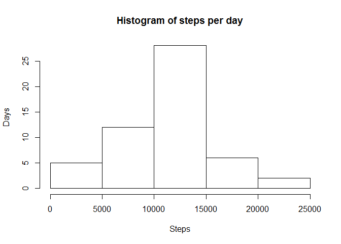
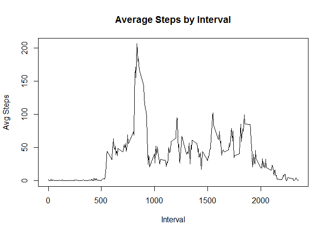
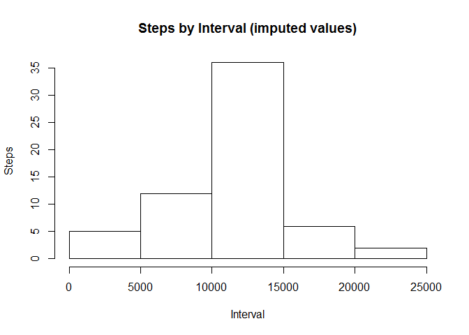
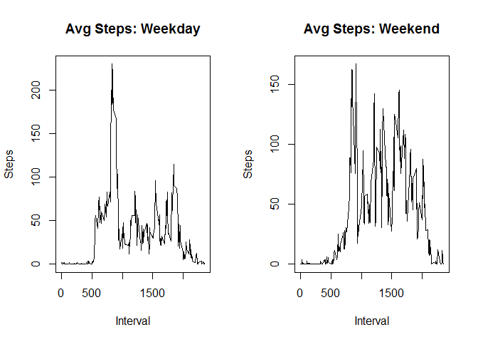

# Reproducible Research: Peer Assessment 1

***


## Loading and preprocessing the data

##Load the data and reset any object values 


```r
rm(list=ls())
activity <- read.csv("activity.csv")
head(activity)
```

```
##   steps       date interval
## 1    NA 2012-10-01        0
## 2    NA 2012-10-01        5
## 3    NA 2012-10-01       10
## 4    NA 2012-10-01       15
## 5    NA 2012-10-01       20
## 6    NA 2012-10-01       25
```


***

## What is mean total number of steps taken per day?

##Calculate the total number of steps taken per day


```r
stepsday <- aggregate(activity["steps"], by = activity["date"], FUN=sum)
stepsday$date <- as.Date(stepsday$date)
head(stepsday)
```

```
##         date steps
## 1 2012-10-01    NA
## 2 2012-10-02   126
## 3 2012-10-03 11352
## 4 2012-10-04 12116
## 5 2012-10-05 13294
## 6 2012-10-06 15420
```

##Make a histogram of the total number of steps taken each day


```r
hist(stepsday$steps,xlab = "Steps", ylab = "Days", main = "Histogram of steps per day")
```




##Calculate and report the mean and median of the total number of steps taken per day


```r
print(mean(stepsday$steps, na.rm=TRUE))
```

```
## [1] 10766.19
```

```r
print(median(stepsday$steps, na.rm=TRUE))
```

```
## [1] 10765
```


***

## What is the average daily activity pattern?

##Make a time series plot (i.e. type = "l") of the 5-minute interval (x-axis) and the average number of steps taken, averaged across all days (y-axis)

Find interval averages


```r
averageint <- aggregate(activity["steps"], by = activity["interval"], FUN=mean, na.rm=TRUE)
head(averageint)
```

```
##   interval     steps
## 1        0 1.7169811
## 2        5 0.3396226
## 3       10 0.1320755
## 4       15 0.1509434
## 5       20 0.0754717
## 6       25 2.0943396
```

```r
plot(averageint,type="l",xlab = "Interval", ylab = "Avg Steps", main = "Average Steps by Interval")
```



Find interval with max avg steps


```r
print(max(averageint$steps)) #this is the max # of steps
```

```
## [1] 206.1698
```

```r
print(averageint$interval[which.max(averageint$steps)]) #this is the interval with the max steps
```

```
## [1] 835
```


***

## Imputing missing values

##Calculate and report the total number of missing values in the dataset (i.e. the total number of rows with NAs)


```r
print(NROW(activity$steps[is.na(activity$steps)]))
```

```
## [1] 2304
```

##Create a new dataset that is equal to the original dataset but with the missing data filled in.

Merge average steps by interval dataframe into the original dataframe, to be used if original "steps" value is NA -- Using the average steps across all days for any interval is my approach to imputing NA values in "steps"


```r
activity2 <- merge(activity, averageint, by="interval")
head(activity2)
```

```
##   interval steps.x       date  steps.y
## 1        0      NA 2012-10-01 1.716981
## 2        0       0 2012-11-23 1.716981
## 3        0       0 2012-10-28 1.716981
## 4        0       0 2012-11-06 1.716981
## 5        0       0 2012-11-24 1.716981
## 6        0       0 2012-11-15 1.716981
```

Evaluate each row to determine if "steps" is NA.  If so, use the interval average.


```r
for(row in 1:nrow(activity2)){ 
  ifelse(is.na(activity2[row,"steps.x"]), activity2[row,"steps.x"]<-activity2[row,"steps.y"], activity2[row,"steps.x"]<-activity2[row,"steps.x"])}
head(activity2)
```

```
##   interval  steps.x       date  steps.y
## 1        0 1.716981 2012-10-01 1.716981
## 2        0 0.000000 2012-11-23 1.716981
## 3        0 0.000000 2012-10-28 1.716981
## 4        0 0.000000 2012-11-06 1.716981
## 5        0 0.000000 2012-11-24 1.716981
## 6        0 0.000000 2012-11-15 1.716981
```

##Make a histogram of the total number of steps taken each day


```r
stepsday2 <- aggregate(activity2["steps.x"], by = activity2["date"], FUN=sum)
stepsday2$date <- as.Date(stepsday2$date)
hist(stepsday2$steps.x, xlab = "Interval", ylab = "Steps", main = "Steps by Interval (imputed values)")
```



##Calculate and report the mean and median of the total number of steps taken per day


```r
print(mean(stepsday2$steps.x, na.rm=TRUE))
```

```
## [1] 10766.19
```

```r
print(median(stepsday2$steps.x, na.rm=TRUE))
```

```
## [1] 10766.19
```

These values are essentially the same as the originals.  Using my method of imputation does not affect the distribution of steps by interval.

***


## Are there differences in activity patterns between weekdays and weekends?

##Create a new factor variable in the dataset with two levels - "weekday" and "weekend" indicating whether a given date is a weekday or weekend day.

Label each date a weekday or weekend


```r
activity2$wkday <- weekdays(as.Date(activity2$date))
activity2$wkend <- "weekday"
activity2[activity2$wkday %in% c("Saturday","Sunday"), "wkend"] = "weekend"
```

##Make a panel plot containing a time series plot (i.e. type = "l") of the 5-minute interval (x-axis) and the average number of steps taken, ##averaged across all weekday days or weekend days (y-axis).

Aggregate imputed values by interval and weekend


```r
averageint3 <- aggregate(activity2$steps.x ~ activity2$interval + activity2$wkend, FUN=mean, na.rm=TRUE)
head(averageint3)
```

```
##   activity2$interval activity2$wkend activity2$steps.x
## 1                  0         weekday        2.25115304
## 2                  5         weekday        0.44528302
## 3                 10         weekday        0.17316562
## 4                 15         weekday        0.19790356
## 5                 20         weekday        0.09895178
## 6                 25         weekday        1.59035639
```

Clean up column names


```r
names(averageint3) <- c("interval","day","steps")
head(averageint3)
```

```
##   interval     day      steps
## 1        0 weekday 2.25115304
## 2        5 weekday 0.44528302
## 3       10 weekday 0.17316562
## 4       15 weekday 0.19790356
## 5       20 weekday 0.09895178
## 6       25 weekday 1.59035639
```

Break into 2 datasets by weekend and weekday


```r
weekendint <- subset(averageint3, day == "weekend")
head(weekendint)
```

```
##     interval     day       steps
## 289        0 weekend 0.214622642
## 290        5 weekend 0.042452830
## 291       10 weekend 0.016509434
## 292       15 weekend 0.018867925
## 293       20 weekend 0.009433962
## 294       25 weekend 3.511792453
```

```r
weekdayint <- subset(averageint3, day == "weekday")
head(weekdayint)
```

```
##   interval     day      steps
## 1        0 weekday 2.25115304
## 2        5 weekday 0.44528302
## 3       10 weekday 0.17316562
## 4       15 weekday 0.19790356
## 5       20 weekday 0.09895178
## 6       25 weekday 1.59035639
```

Build the pair of time-series plots for weekend and weekday steps by interval


```r
par(mfrow=c(1,2))
plot(weekdayint$interval,weekdayint$steps, type="l", xlab = "Interval", ylab = "Steps", main = "Avg Steps: Weekday")
plot(weekendint$interval,weekendint$steps, type="l", xlab = "Interval", ylab = "Steps", main = "Avg Steps: Weekend")
```



